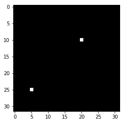
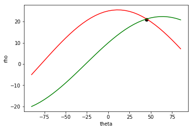

```
import cv2
import numpy as np 
import matplotlib.pyplot as plt
%matplotlib inline
```


```
image = np.zeros((32,32),dtype='uint8')
image[25,5] = 255
image[10,20] = 255

plt.imshow(image,cmap='gray')

```


    <matplotlib.image.AxesImage at 0x7f2d7777cef0>





```
from math import cos,sin,pi
color=['r','g']
count=0
for x,y in [(25,5),(10,20)]:
  rho = []
  for theta in range(-90,90,5):
    rho.append(x*cos(theta*pi/180.)+y*sin(theta*pi/180.))
  plt.plot(range(-90,90,5),rho,color=color[count])
  count+=1
plt.xlabel("theta")
plt.ylabel("rho")
plt.scatter(45,21,s=40,color='k')
plt.show()
```





```
!jupyter nbconvert --to markdown Hough_Explained.ipynb
```


```

```
